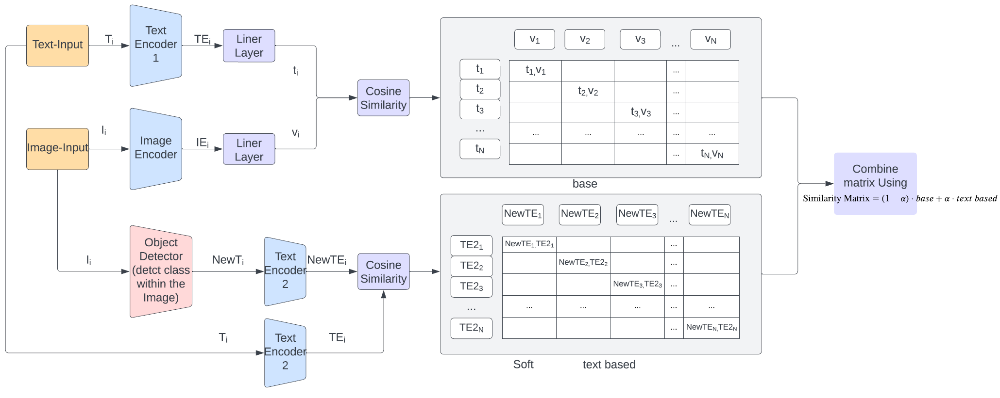

# 


# Text-based SoftCLIP: Clip model softened using relaxed similarity

## Description

The Clip model is a well-known multimodal representation learning framework that has demonstrated remarkable performance across several natural language processing and computer vision tasks. However, the efficacy of this model is heavily reliant on high-quality image-text pairs that are entirely independent of each other to prevent any biases and facilitate accurate representation learning. Unfortunately, obtaining such pairs remains a challenging task, and the noise persists in commonly used datasets. To address this issue, we propose Text-based SoftCLIP, a novel approach that uses text embedding similarities to achieve a soft cross-modal alignment. This approach allows for greater flexibility in image-text pairs, thereby enabling the model to capture many-to-many relationships between the two modalities. SoftCLIP generates captions from images and compares their similarity with the original captions to create a softened target, allowing for greater flexibility in image-text pairs. We use pre-trained models, including BERT, RoBERTa, ResNet50, ViT, and Yolo V7, and experiment on COCO dataset. Our approach does not significantly impact object detection accuracy in image-text pairing tasks, and the accuracy scores are comparable to those trained with a strict one-to-one mapping. This suggests that our approach is better suited for handling noisy data and can better adapt to real-world data's unpredictable nature.

## Flow Chart


## Getting Started

### Installing

* Downloading: git clone https://github.com/CZhao97/Text-based-SoftCLIP-Clip-model-softened-using-relaxed-similarity
* pip install -r requirements.txt

### Executing program

* Our problem can be directly executed using sh files provided with correct path settting
```
Training: sh train_mode.sh
Testing: sh test.sh
```


## Authors (contributed equally)

Contributors names and contact info

Chen Zhao (czchen.zhao@mail.utoronto.ca)

Yuxuan Wang (markyx.wang@mail.utoronto.ca)

Qian Tang (qianqian.tang@mail.utoronto.ca)

## Version History

* 0.2
    * Soft similarity calculation updated
* 0.1
    * Hard similarity base model

## Reference

* [BERT](https://arxiv.org/abs/1810.04805)
* [RoBERTa](https://arxiv.org/abs/1907.11692)
* [ResNet](https://arxiv.org/abs/1512.03385)
* [ViT](https://arxiv.org/abs/2010.11929)
* [YoLo V7](https://arxiv.org/abs/2207.02696)
* [CoCo](https://arxiv.org/abs/1405.0312)
